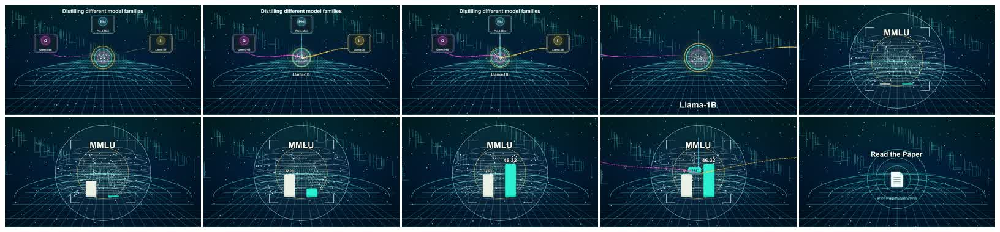

# Neural Distillation Video Style

Code for generating a short AI research explainer video in the style of the referenced X clip: dark technical background, neon data streams, model-family cards, a central distillation orb, an animated MMLU chart, a final paper call-to-action, and a synthesized sci-fi soundtrack.

## Demo

[Play the rendered MP4](media/distillation_style.mp4)



## Requirements

- Python 3.11+
- FFmpeg available on PATH
- `uv` recommended for dependency management

## Generate The Video

```bash
uv run python src/neural_distillation_video.py --out output/distillation_style.mp4
```

Optional controls:

```bash
uv run python src/neural_distillation_video.py \
  --out output/custom.mp4 \
  --duration 10 \
  --fps 24 \
  --paper-url "arxiv.org/pdf/2605.21699"
```

For a silent export:

```bash
uv run python src/neural_distillation_video.py --out output/silent.mp4 --no-audio
```

## What To Edit

Open `src/neural_distillation_video.py` and adjust:

- `TEACHERS` for model names and neon colors.
- `METRICS` for chart labels and values.
- `SceneConfig` defaults for duration, resolution, and call-to-action text.
- The `synthesize_audio` event schedule for hums, whooshes, pings, and chart accents.

The renderer writes temporary PNG frames, synthesizes a temporary WAV, muxes everything with FFmpeg, and removes temporary files by default.
